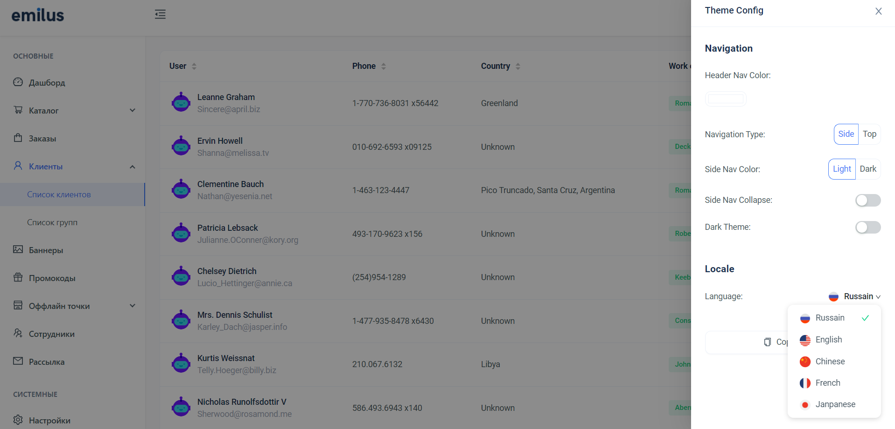

# Admin Panel

> 📊Tool for convenient management of your site

Live site: <https://panel-ofadministrator.netlify.app/>
 

### Used technologies

- React
- Mapbox API
- React Router
- library: axios
- architectural style - OOP

### Realized features

I participated in the revision of this admin panel.

Add folowing features:

- sidebar
- ability to change language
- getting users from API, decoded coordinates and displaying them on page
- ability to edit user's profile

## 🚀Quick Setup

1.  Clone this repository:

        git clone https://github.com/DmitriZaytsev/Admin-panel.git

2.  Be sure that you use old Node.js version like 14.21.3

3.  Move to cloned folder

        cd Admin-panel

4.  Install npm packages:

        npm i

         or

        yarn install

5.  Open site in browser:

        npm run start

             or

        yarn start
